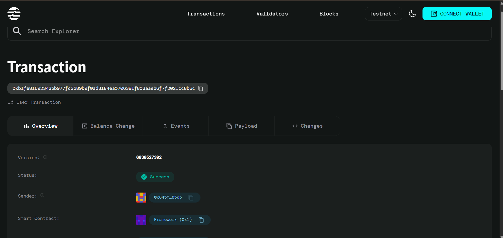

# Wenidi - Blockchain Attendance System
Team members: Hasini Chandana, Pitha Likhitha Sai

Description:
A decentralized attendance tracking system built on the Aptos blockchain using Move smart contracts and React.js frontend.

## 🌟 Features

- *Multi-Role System*: Support for Students, Teachers, and Administrators
- *Blockchain Security*: Immutable attendance records on Aptos blockchain
- *Real-time Tracking*: Check-in and check-out functionality with timestamps
- *Admin Dashboard*: Comprehensive view of all attendance records
- *Modern UI*: Responsive design with Tailwind CSS
- *Wallet Integration*: Support for multiple Aptos wallets (Petra, Pontem, Martian)

## 🏗 Architecture

### Smart Contract (Move)
- *Module*: attendance_system
- *Key Features*:
  - User registration and management
  - Attendance marking with timestamps
  - Role-based access control
  - Event emission for activity tracking
  - View functions for data retrieval

### Frontend (React.js)
- *Framework*: React 18 with hooks
- *Styling*: Tailwind CSS with custom components
- *State Management*: Context API for wallet and user management
- *Wallet Integration*: Aptos Wallet Adapter
- *Icons*: Lucide React

## 📋 Prerequisites

Before you begin, ensure you have:

- Node.js (v16 or higher)
- npm or yarn
- Aptos CLI installed
- An Aptos wallet (Petra recommended)

## 🚀 Quick Start

### 1. Clone and Setup

bash
# Clone the repository
git clone <your-repo-url>
cd wenidi-attendance-dapp

# Install dependencies
npm install

# Install Aptos CLI (if not installed)
curl -fsSL "https://aptos.dev/scripts/install_cli.py" | python3

### 2. Deploy Smart Contract

bash
# Make deployment script executable
chmod +x deploy.sh

# Run deployment
./deploy.sh

This will:
- Compile the Move contract
- Run tests
- Deploy to Aptos testnet
- Initialize the system
- Update frontend configuration

### 3. Start Frontend

bash
# Start development server
npm start

# The app will be available at http://localhost:3000

## 📱 User Guide

### For Students
1. *Connect Wallet*: Click "Login as Student" and connect your Aptos wallet
2. *Register*: If first time, register with your name
3. *Mark Attendance*: Use the dashboard to mark present/absent for each day
4. *View History*: Check your attendance history in the dashboard

### For Teachers
1. *Connect Wallet*: Click "Login as Teacher" and connect your wallet
2. *Register*: Register as a teacher user
3. *Mark Student Attendance*: Select students and mark their attendance
4. *View Class Summary*: Monitor class attendance statistics

### For Administrators
1. *Connect Wallet*: Click "Login as Admin" (requires admin privileges)
2. *View Overview*: Access comprehensive attendance statistics
3. *Manage Users*: View all registered users and their details
4. *Monitor Attendance*: Review daily attendance records for all users

## 🔧 Configuration

### Environment Variables

Create a .env file in the root directory:

env
REACT_APP_NETWORK=testnet
REACT_APP_MODULE_ADDRESS=0xYOUR_CONTRACT_ADDRESS
REACT_APP_MODULE_NAME=attendance_system

### Smart Contract Configuration

Update Move.toml for custom deployment:

toml
[addresses]
wenidi_addr = "YOUR_ACCOUNT_ADDRESS"

## 📚 Smart Contract Functions

### Public Entry Functions

- initialize(admin: &signer) - Initialize the system (admin only)
- register_user(account: &signer, name: String, user_type: u8) - Register new user
- mark_attendance(marker: &signer, user_address: address, date: String, is_present: bool) - Mark attendance
- mark_checkout(user: &signer, date: String) - Mark checkout time

### View Functions

- get_user_info(user_address: address): User - Get user information
- get_user_attendance(user_address: address, date: String): AttendanceRecord - Get user's attendance
- get_daily_attendance(date: String): vector<AttendanceRecord> - Get all attendance for a date
- is_user_registered(user_address: address): bool - Check if user is registered

## 🛠 Development

### Project Structure

wenidi-attendance-dapp/
├── sources/                 # Move smart contracts
│   └── attendance_system.move
├── src/                    # React frontend
│   ├── components/         # React components
│   ├── context/           # Context providers
│   ├── services/          # API services
│   └── App.js            # Main app component
├── Move.toml              # Move configuration
├── package.json           # Node.js dependencies
└── deploy.sh             # Deployment script

### Running Tests

bash
# Test smart contracts
aptos move test

# Test frontend (if tests are written)
npm test

### Building for Production

bash
# Build React app
npm run build

# The build folder contains production-ready files

## 🔒 Security Considerations

- *Access Control*: Role-based permissions for different user types
- *Input Validation*: Proper validation of all user inputs
- *Timestamp Verification*: Server-side timestamp validation
- *Wallet Security*: Users maintain control of their private keys

## 🚨 Troubleshooting

### Common Issues

1. *Wallet Connection Failed*
   - Ensure you have a supported Aptos wallet installed
   - Check if wallet is connected to the correct network

2. *Transaction Failed*
   - Verify you have sufficient APT for gas fees
   - Check if you're registered in the system

3. *Contract Not Found*
   - Verify the contract address in aptosService.js
   - Ensure the contract is deployed on the correct network

### Getting Help

1. Check the Aptos documentation: https://aptos.dev
2. Review Move language guide: https://move-language.github.io/move/
3. Aptos Discord community: https://discord.gg/aptosnetwork

## 📄 License

This project is licensed under the MIT License - see the [LICENSE](LICENSE) file for details.

## 🤝 Contributing

1. Fork the repository
2. Create your feature branch (git checkout -b feature/AmazingFeature)
3. Commit your changes (git commit -m 'Add some AmazingFeature')
4. Push to the branch (git push origin feature/AmazingFeature)
5. Open a Pull Request

## 🎯 Roadmap

- [ ] Mobile app development
- [ ] Integration with educational management systems
- [ ] Advanced analytics and reporting
- [ ] Multi-language support
- [ ] Offline attendance marking
- [ ] Biometric authentication integration

## 📞 Support

For support and questions:
- Create an issue on GitHub
- Join our community Discord
- Email: support@wenidi.app

---

----
Linkedin Profiles: Likhitha:  www.linkedin.com/in/likhitha-sai-pitha-287a4832b
                   Hasini: https://www.linkedin.com/in/hasini-chandana-g-v-s-1a3819374/

                   
wenidi ppt link: https://docs.google.com/presentation/d/1TEOqNq_eyBi-9VS3kZhW5b_2Q4qBsII0/edit?usp=sharing&ouid=110849707827326512505&rtpof=true&sd=true

Built with ❤ using Aptos and React.js
# Wenidi
attendence blockchain based aptos application
